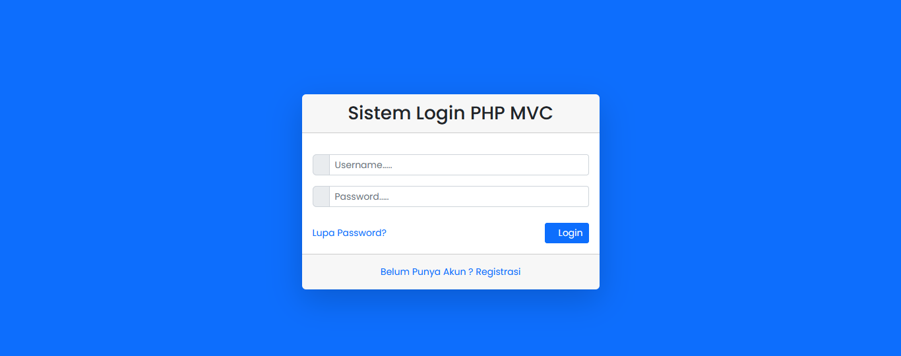
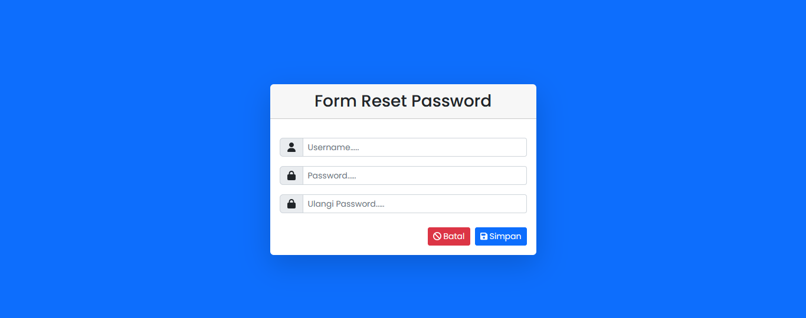
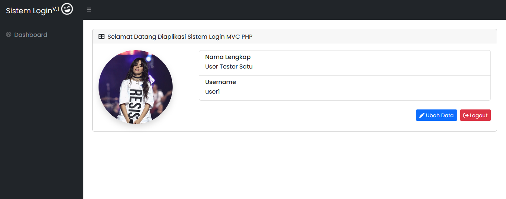
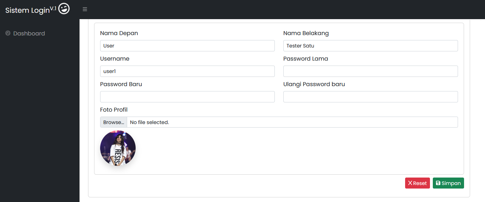

# SISTEM LOGIN DAN REGISTRASI PHP MVC V1 (Belajar)
Aplikasi ini adalah Sistem Login dan Registrasi sederhana menggunakan PHP + MySQL, yang digunakan untuk belajar

## Instalasi
1. Simpan project ke dalam direktori lokal XAMPP (htdocs).
2. Buat database dengan nama: `db_loginregistrasi_phpmvc_v1`.
3. Import database yang ada di: public/database/db_loginregistrasi_phpmvc_v1.sql
4. Ubah file **.htaccess** pada baris: RewriteBase /sistem_login_phpmvc_nwarsyh_v1/ `Sesuaikan dengan lokasi project.` ;
5. Ubah file **app/config/config.php** pada baris: define('BASEURL', 'http://sistem_login_phpmvc_nwarsyh_v1') `Sesuaikan dengan lokasi project.` ;

## Fitur
1. Routing aplikasi pada folder routing seperti : `(RouteLogin)`, `(ControllerLogin)`, `(DatabaseLoin)` ;
2. Penggunaan **Models** Setiap File Proses SQL;
3. Penggunaan **Controlers** Untuk Konfigurasi Laman ; 
4. Penggunaan **views** Untuk Tampilan Laman ;
5. Fitur Registrasi untuk user baru ;
6. Fitur Lupa Password, untuk reset password user ;
7. Update data untuk ubah data Nama, Username dan Password ;
10. Upload Foto dan Update Foto sebagai foto profil ;
11. Dan lainnya.

##Teknologi
1. PHP 7 ke aatas
2. MySQL (PDO)
3. Bootstrap
4. Font Awesome
4. SB Admin 2 Templates

## Screenshot
### Form Login

### Form Registrasi

### Form Reset Passwordn

### Laman Profil

### Lama Ubah Data

## Sumber Referensi
- Template: [SB Admin 2](https://startbootstrap.com/template/sb-admin)
- Tutorial Artikel dari Website
- Tutorial Artikel dari Buku
- Serta hasil belajar dari berbagai sumber lainnya

## Tujuan
Repository ini dibuat untuk **pembelajaran pribadi** dan **latihan menggunakan GitHub**.
Semoga bisa bermanfaat bagi yang mau belajar, silahkan kembangkan lebi lanjut 🙌

## License
Proyek ini dirilis dengan lisensi **MIT**, dan dibuat khusus untuk tujuan pembelajaran.  
Boleh dipelajari, digunakan, dan dikembangkan lebih lanjut selama tetap mencantumkan kredit.  

Lihat file [LICENSE](LICENSE) untuk detail lengkap.

# Terima Kasih

